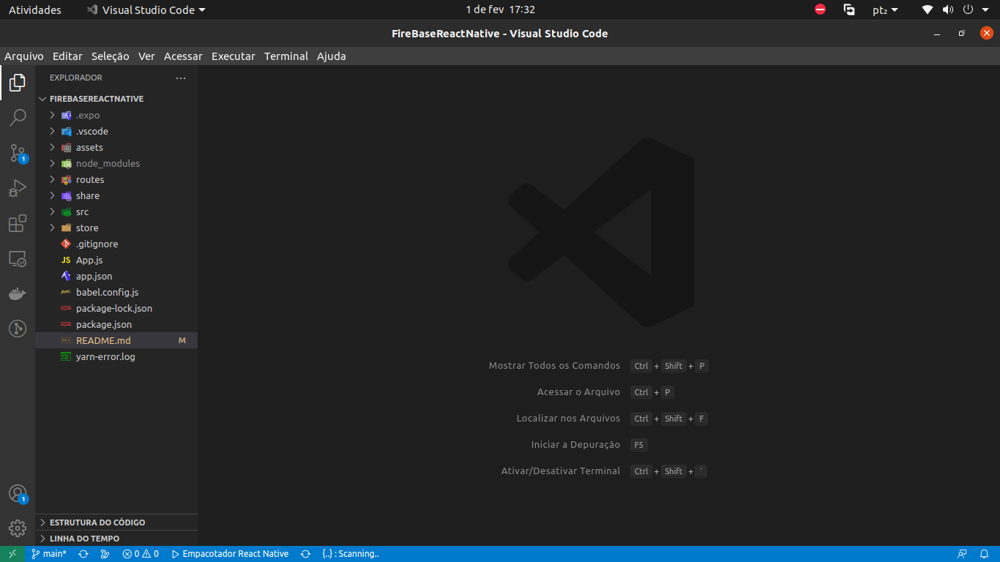
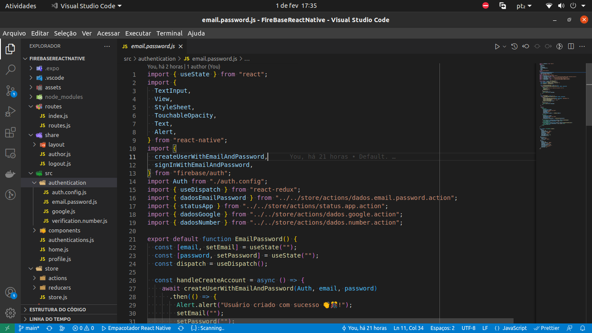

<div align='center'>

# FireBase with React-Native and Expo

This is a simple **react-native** app, using **firebase** for user authentication and **Expo** for app simulation.


The purpose of this application is to login with the ``3 authentication models``, after logging in the user data will be shown.

</div>
<br/><br/>

## Authentication models:

1. [Google](https://www.google.com)
2. Emial with password
3. Phone number

## Menu
1. Home
2. Profile


<details><summary>Installation mode</summary>
<p>

#### Development dependency!

```js
   npm install ou yarn

//  Rotas
1. npm install @react-navigation/native @react-navigation/native-stack
2. npx expo install react-native-screens react-native-safe-area-context
```

#### Expo!

```js
- //Global Expo CLI
   npm install -g expo-cli

- //Checking CLI Version
   expo --version
   
- //Create a new app
    npx create-expo-app my-app

```

####  Ui Kitten!

```js
1. npm i @ui-kitten/components @eva-design/eva react-native-svg
2. npm i @ui-kitten/eva-icons react-native-svg
3. expo install react-native-svg@9.13.6
```

#### Firebase!

```js

# //Using npm
  npm install --save @react-native-firebase/app

- //Using Yarn
  yarn add @react-native-firebase/app
-----------------------------------------
1. npx expo install expo-firebase-recaptcha
2. npx expo install react-native-webview.
```
</p>
</details>


#
#


<details><summary>Attachments</summary>
<p>

#### Imgs!

<div align='center'>
   
   
</div>


</p>
</details>

#
# Technologies

1. [ReactNative](https://reactnative.dev/)
2. [Expo](https://docs.expo.dev/)
3. [Firebase](https://firebase.google.com/)
4. [Google](https://docs.expo.dev/guides/authentication/#google)
5. [Password](https://firebase.google.com/docs/auth/web/password-auth)
6. [FirebaseRecaptcha](https://docs.expo.dev/versions/latest/sdk/firebase-recaptcha/)

##
#
###### Author : Aniceto Jolela 🥰
 My  | [Linkedin](https://www.linkedin.com/in/aniceto-jolela-076547184/))